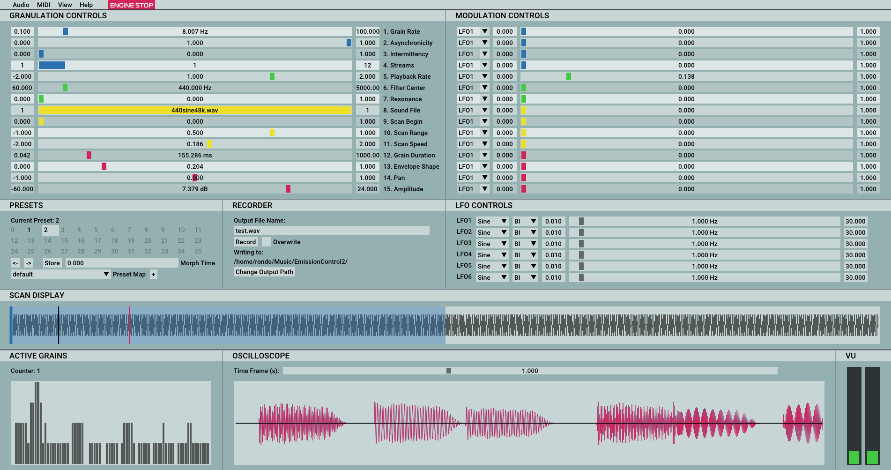
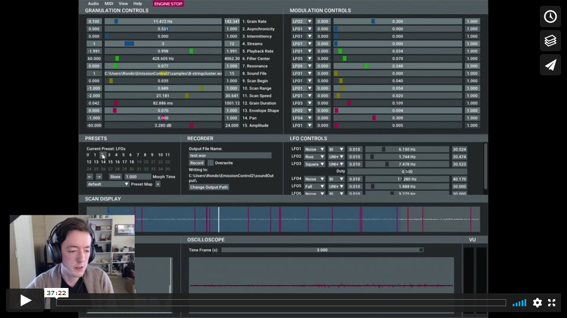
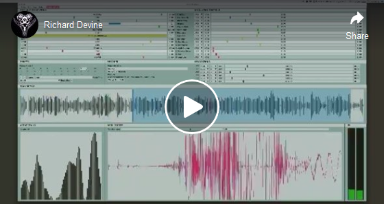
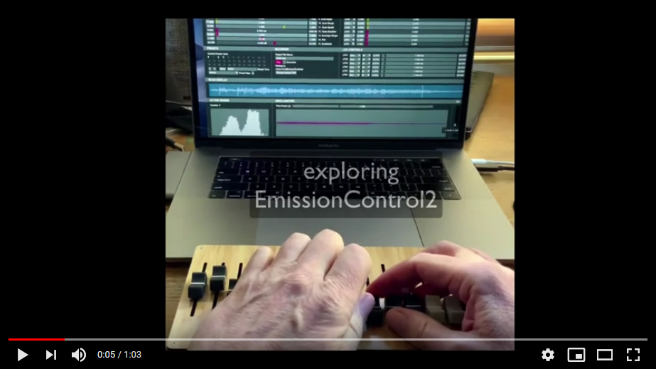

# EmissionControl2

EmissionControl2 (EC2) is a new standalone interactive real-time application for granular synthesis and sound file granulation. It is available for OSX, Linux, and Windows. 

### Download the latest release for your operating system here: https://github.com/EmissionControl2/EmissionControl2/releases/latest

  

Features include:

- Granulation of multiple sound files simultaneously
- Multiple simultaneous grain streams
- Synchronous and asynchronous grain emission
- Intermittency control
- Per-grain signal processing (envelope, waveform, amplitude, frequency, spatial position, filter center frequency and resonance)
- Unique filter design optimized for per-grain synthesis
- Matrix modulation control of all granulation parameters with six LFOs
- Real-time display of peak amplitude, grain counter, waveform, and scan range
- Scalable GUI and font size
- MIDI Learn enables mapping to any MIDI continuous controller.
- Code is open source and available at GitHub
- Maximal "Grain Integrity" (tm)

## Videos
### Controlling EmissionControl2 (lecture tutorial)

### What people are doing with it

## Mailing Lists

### New releases, major bug fixes, and other big news (low-volume list)
https://lists.sr.ht/~rondo/emissioncontrol2-announce

To subscribe, send a blank email to: ~rondo/emissioncontrol2-announce+subscribe@lists.sr.ht

### Discussion, questions, ideas, tips, sounds and video, and other general postings (higher-volume list; anyone can post here)
https://lists.sr.ht/~rondo/emissioncontrol2-discuss

To subscribe, send a blank email to: ~rondo/emissioncontrol2-discuss+subscribe@lists.sr.ht

To post to this list, send your post to: ~rondo/emissioncontrol2-discuss@lists.sr.ht

## Building
### Debian

- First, check the releases page to see if the pre-compiled installers work for you: https://github.com/EmissionControl2/EmissionControl2/releases/latest

- This project uses cmake to build so if you don't have cmake then install it (Minimum version: 3.13) and make sure your c and c++ compilers are defined in your environment.

- Run the following in a terminal to install the necessary libraries for building:

`sudo apt install libgtk-3-dev libasound2-dev libsndfile1-dev libfftw3-dev libjack-dev`
 
- git clone the repository and run some the scripts that automate the configure/build/install process.

`git clone https://github.com/EmissionControl2/EmissionControl2.git`

`cd EmissionControl2/ecSource`

`./scripts/configure.sh`

`./scripts/build.sh`

`sudo ./scripts/install_linux.sh` (this will put the binary in /usr/bin and set up resources in the paths where EC2 expects them to be)

To undo the files installed with install_linux.sh script, I've included the `scripts/uninstall_linux.sh` script as well.

### Arch Linux

- Must have cmake (3.13 or later), git, and base-devel packages installed.

`git clone https://github.com/EmissionControl2/EmissionControl2.git`

`cd EmissionControl2/ecSource`

`./scripts/configure.sh`

`./scripts/build.sh`

`sudo ./scripts/install_linux.sh` (this will put the binary in /usr/bin and set up resources in the paths where EC2 expects them to be)

To undo the files installed with install_linux.sh script, I've included the `scripts/uninstall_linux.sh` script as well.

### OS X

- First, check the releases page to see if the pre-compiled installers work for you: https://github.com/EmissionControl2/EmissionControl2/releases/latest

You must have cmake installed (version 3.10 or later), and Xcode (hopefully we can get rid of this dependency soon).

- First, clone the repo:

`git clone https://github.com/EmissionControl2/EmissionControl2.git`

- cd into EmissionControl2/ecSource

`cd EmissionControl2/ecSource`

- run configure script:

`./scripts/configure.sh`

- run build script:

`./scripts/build.sh`

- EmissionControl2 is located in `EmissionControl2/ecSource/bin/`

### Windows (Visual Studio)

For installation through Visual Studio (taken from the allolib repo: https://github.com/AlloSphere-Research-Group/allolib):

    Install Visual Studio 2017 Community Edition from https://visualstudio.microsoft.com/downloads/

    During installation options:

    a. Install "Desktop development with C++" workload

    b. Install Individual components: C++/CLI support, Git for Windows, Visual C++ Tools for Cmake

Install libsndfile: Aim your browser at http://www.mega-nerd.com/libsndfile/#Download. Download and install the 64-bit version: libsndfile-1.0.xx-w64-setup.exe.
    - Install this at the default location.

#### Compile Emission Control
- Note that you need Visual Studio installed for the below scripts to work.

- Clone the repo using the git bash terminal:

`git clone https://github.com/EmissionControl2/EmissionControl2.git`

- Open Visual Studio pointed at the directory `EmissionControl2\`

- In Visual Studio, open the Developer Power Shell.

- From there, you can run the bash scripts:

- `.\ecSource\scripts\configure.sh`
- `.\ecSource\scripts\build.sh`

- When first running the above scripts, Visual Studio will ask what program would you like to open this file with. Choose `Git Bash`.

